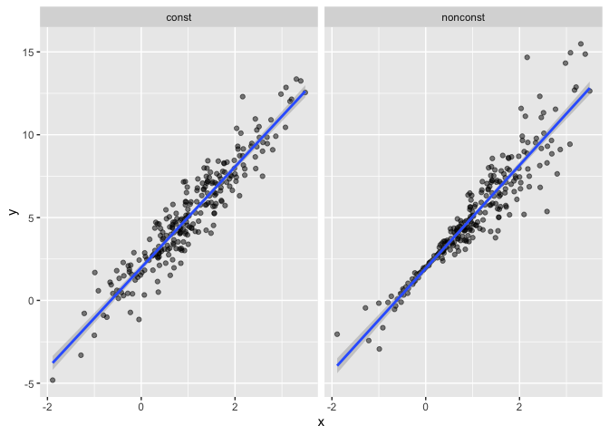
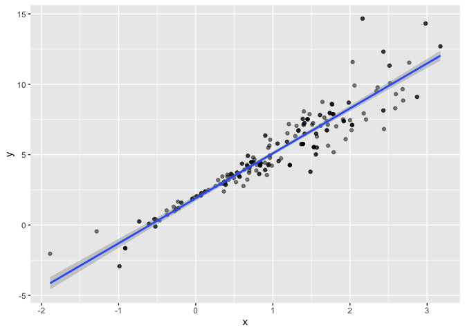

bootstrapping
================
Qinting Shen
2023-11-16

## Generate a relavant example

``` r
n_samp = 250

sim_df_const = 
  tibble(
    x = rnorm(n_samp, 1, 1),
    error = rnorm(n_samp, 0, 1),
    y = 2 + 3 * x + error
  )

sim_df_nonconst = sim_df_const |> 
  mutate(
  error = error * .75 * x,
  y = 2 + 3 * x + error
)
```

``` r
sim_df = 
  bind_rows(const = sim_df_const, nonconst = sim_df_nonconst, .id = "data_source") 

sim_df |> 
  ggplot(aes(x = x, y = y)) + 
  geom_point(alpha = .5) +
  stat_smooth(method = "lm") +
  facet_grid(~data_source) 
```

    ## `geom_smooth()` using formula = 'y ~ x'

<!-- -->

``` r
lm(y ~ x, data = sim_df_const) |> 
  broom::tidy() 
```

    ## # A tibble: 2 × 5
    ##   term        estimate std.error statistic   p.value
    ##   <chr>          <dbl>     <dbl>     <dbl>     <dbl>
    ## 1 (Intercept)     1.98    0.0981      20.2 3.65e- 54
    ## 2 x               3.04    0.0699      43.5 3.84e-118

``` r
lm(y ~ x, data = sim_df_nonconst) |> 
  broom::tidy() 
```

    ## # A tibble: 2 × 5
    ##   term        estimate std.error statistic   p.value
    ##   <chr>          <dbl>     <dbl>     <dbl>     <dbl>
    ## 1 (Intercept)     1.93    0.105       18.5 1.88e- 48
    ## 2 x               3.11    0.0747      41.7 5.76e-114

## Draw and analyze a bootstrap sample

Start with a lil fuction

``` r
boot_sample = function(df) {
  sample_frac(df, replace = TRUE)
}
```

let’s see how it works

``` r
boot_sample(sim_df_nonconst) |> 
  ggplot(aes(x = x, y = y)) + 
  geom_point(alpha = .5) +
  stat_smooth(method = "lm")
```

    ## `geom_smooth()` using formula = 'y ~ x'

<!-- -->

## Draw a lot of samples and analyze them

``` r
boot_straps = 
  tibble(strap_number = 1:1000) |> 
  mutate(
    strap_sample = map(strap_number, \(i) boot_sample(df = sim_df_nonconst))
  )

boot_straps
```

    ## # A tibble: 1,000 × 2
    ##    strap_number strap_sample      
    ##           <int> <list>            
    ##  1            1 <tibble [250 × 3]>
    ##  2            2 <tibble [250 × 3]>
    ##  3            3 <tibble [250 × 3]>
    ##  4            4 <tibble [250 × 3]>
    ##  5            5 <tibble [250 × 3]>
    ##  6            6 <tibble [250 × 3]>
    ##  7            7 <tibble [250 × 3]>
    ##  8            8 <tibble [250 × 3]>
    ##  9            9 <tibble [250 × 3]>
    ## 10           10 <tibble [250 × 3]>
    ## # ℹ 990 more rows

``` r
boot_straps |> 
  slice(1:3) |> 
  mutate(strap_sample = map(strap_sample, arrange, x)) |> # x?
  pull(strap_sample)
```

    ## [[1]]
    ## # A tibble: 250 × 3
    ##         x   error       y
    ##     <dbl>   <dbl>   <dbl>
    ##  1 -1.89   1.62   -2.04  
    ##  2 -1.89   1.62   -2.04  
    ##  3 -1.21  -0.781  -2.43  
    ##  4 -1.21  -0.781  -2.43  
    ##  5 -1.00   0.832  -0.169 
    ##  6 -0.989 -1.97   -2.93  
    ##  7 -0.914 -0.908  -1.65  
    ##  8 -0.606 -0.106   0.0774
    ##  9 -0.536  0.0227  0.413 
    ## 10 -0.524 -0.536  -0.106 
    ## # ℹ 240 more rows
    ## 
    ## [[2]]
    ## # A tibble: 250 × 3
    ##         x  error       y
    ##     <dbl>  <dbl>   <dbl>
    ##  1 -1.29   1.40  -0.454 
    ##  2 -0.989 -1.97  -2.93  
    ##  3 -0.914 -0.908 -1.65  
    ##  4 -0.914 -0.908 -1.65  
    ##  5 -0.805  0.292 -0.123 
    ##  6 -0.805  0.292 -0.123 
    ##  7 -0.665 -0.544 -0.539 
    ##  8 -0.641 -0.416 -0.338 
    ##  9 -0.606 -0.106  0.0774
    ## 10 -0.606 -0.106  0.0774
    ## # ℹ 240 more rows
    ## 
    ## [[3]]
    ## # A tibble: 250 × 3
    ##         x  error      y
    ##     <dbl>  <dbl>  <dbl>
    ##  1 -1.89   1.62  -2.04 
    ##  2 -1.89   1.62  -2.04 
    ##  3 -1.29   1.40  -0.454
    ##  4 -1.29   1.40  -0.454
    ##  5 -1.00   0.832 -0.169
    ##  6 -0.914 -0.908 -1.65 
    ##  7 -0.805  0.292 -0.123
    ##  8 -0.665 -0.544 -0.539
    ##  9 -0.665 -0.544 -0.539
    ## 10 -0.665 -0.544 -0.539
    ## # ℹ 240 more rows

``` r
boot_straps |> 
  slice(1:3) |> 
  unnest(strap_sample) |> 
  ggplot(aes(x = x, y = y)) + 
  geom_point(alpha = .5) +
  stat_smooth(method = "lm", se = FALSE) +
  facet_grid(~strap_number) 
```

    ## `geom_smooth()` using formula = 'y ~ x'

<!-- -->

Now do the ’lm\` fit.

``` r
bootstrap_results = 
  boot_straps |> 
  mutate(
    models = map(strap_sample, \(df) lm(y ~ x, data = df) ),
    results = map(models, broom::tidy)) |> 
  select(-strap_sample, -models) |> 
  unnest(results)
```

try to summarize these results – get a bootstrap SE

``` r
bootstrap_results |> 
  group_by(term) |> 
  summarize(boot_se = sd(estimate)) |> 
  knitr::kable(digits = 3)
```

| term        | boot_se |
|:------------|--------:|
| (Intercept) |   0.075 |
| x           |   0.101 |

look at the distribution

``` r
bootstrap_results |> 
  filter(term == 'x') |> 
  ggplot(aes(x = estimate)) +
  geom_density()
```

<!-- -->

can I construct a CI

``` r
bootstrap_results |> 
  group_by(term) |> 
  summarize(
    ci_lower = quantile(estimate, 0.025), 
    ci_upper = quantile(estimate, 0.975))
```

    ## # A tibble: 2 × 3
    ##   term        ci_lower ci_upper
    ##   <chr>          <dbl>    <dbl>
    ## 1 (Intercept)     1.79     2.08
    ## 2 x               2.91     3.31

## Airbnb

``` r
data("nyc_airbnb")

nyc_airbnb = 
  nyc_airbnb |> 
  mutate(stars = review_scores_location / 2) |> 
  rename(
    borough = neighbourhood_group,
    neighborhood = neighbourhood) |> 
  filter(borough != "Staten Island") |> 
  drop_na(price, stars) |> 
  select(price, stars, borough, neighborhood, room_type)
```

let’s fit a regression of `price` on other variables and look at
residuals

``` r
airbnb_fit =
  nyc_airbnb |> 
  lm(price ~ stars + room_type + borough, data = _)
```

residuals!

``` r
nyc_airbnb |> 
  modelr::add_residuals(airbnb_fit) |> 
  ggplot(aes(x = stars, y = resid)) + 
  geom_point() 
```

<!-- -->

run a bootstrap on this whole thing to get estimates for the effect of
`stars` on `price`

``` r
manhattan_df = 
  nyc_airbnb |> 
  filter(borough == "Manhattan") 

boot_results =
  tibble(strap_number = 1:1000) |> 
  mutate(
    strap_sample = map(strap_number, \(i) boot_sample(manhattan_df)),
    models = map(strap_sample, \(df) lm(price ~ stars +room_type , data = df)),
    results = map(models, broom::tidy)) |> 
  select(strap_number,results) |> 
  unnest(results) 

boot_results |> 
  filter(term == "stars") |> 
  ggplot(aes(x = estimate)) + geom_density()
```

<!-- -->
